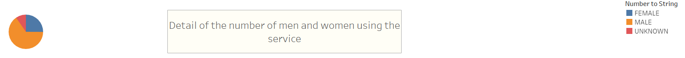
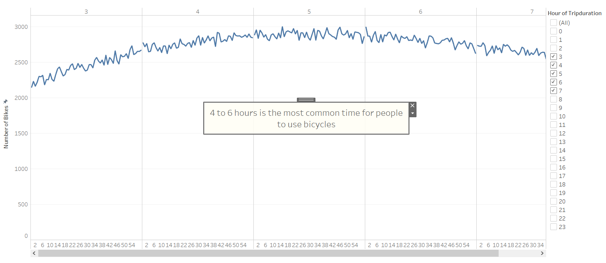
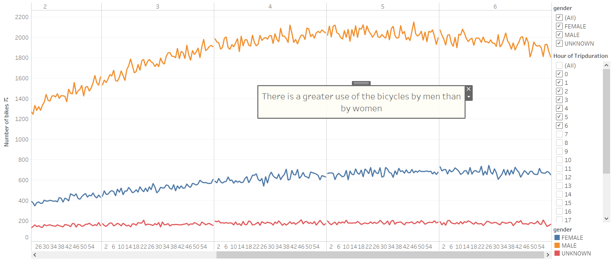
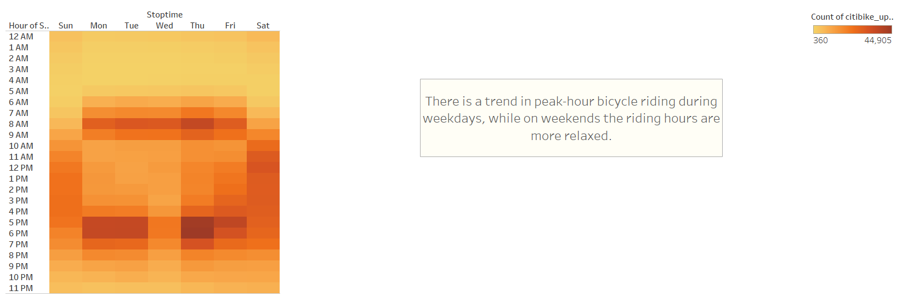
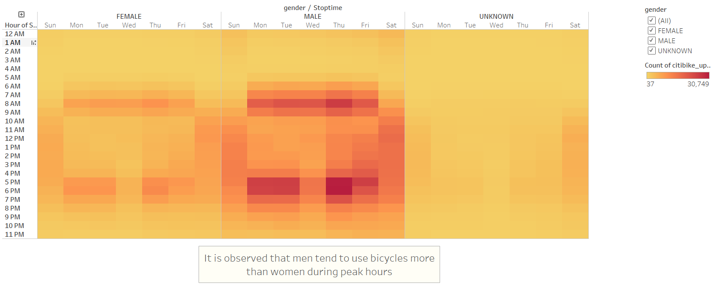
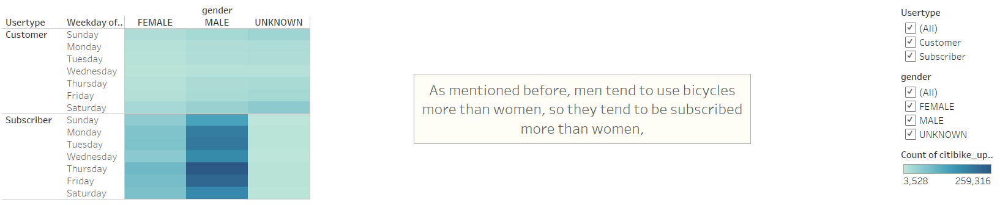

# Citibike project

## Overview of the analysis

The purpose of this was to analyze the viability of a project that aims creating a service like Citibike, a bike service offered in New York City, in Des Moines. 

Data from Citibike NY was used, specifically data from the month of August and it was adapted to our needs, in order to show to potential investors that the execution of this project will be successful.

## Results

1.	This study is based on Citibike data of the usage of the service in New York city in the month of August of 2019. The total of rides was 2.344.224.

2.	From that previous number, we can take a first look of this graph that gives us an idea of the gender of the users generating those rides. Clearly, more men are using the service than women. 
 
 

3.	The following chart shows that in general the bikes users do not use them for a short period of time neither a very long one. They usually use the bikes for periods of 4 to 6 hours.

4.	This visualization reveals the breakdown of user trips by gender and help us appreciate that there is a greater amount of men using the bicycles than women, even thought they have a similar pattern in the usage (4 to 6 hours)

5.	Looking at our heatmap we can observe that from the usage time mentioned before, there is a trend in using the bikes on peak-hours from Monday to Friday. However, on Saturdays and Sundays the bike usage starts later in the day. 

6.	Doing a differentiation on gender at our heatmap, once again we probe that during the peak-hours, are the men the ones using more the service. 

 
7.	Finally, the last visualization shows us a breakdown on the user type by gender, where we observed that women tend to be more a casual costumer while men tend to be subscribers, probably because they use the service more often. 

## Summary

The analysis was very useful to understanding the users who rent the bikes most and how they are used. We can say that this service in New York is mostly use by men rather than women and that the usage period is higher on weekdays at peak-hours. It is important to keep this information in mind, as the business should take decisions considering this. For example, a good time for doing bike maintenance will be around 1 to 3 am in the morning, and not 5 am because people start using the bikes around that time. 

Apart from all the visualizations created here, in order to replicate this business model in another city like Des Moines, I believe it will be useful to also analyze areas in the city with more population density to install the bike docks and also taking into consideration the weather in the city to see which months will be the more profitable ones.  
